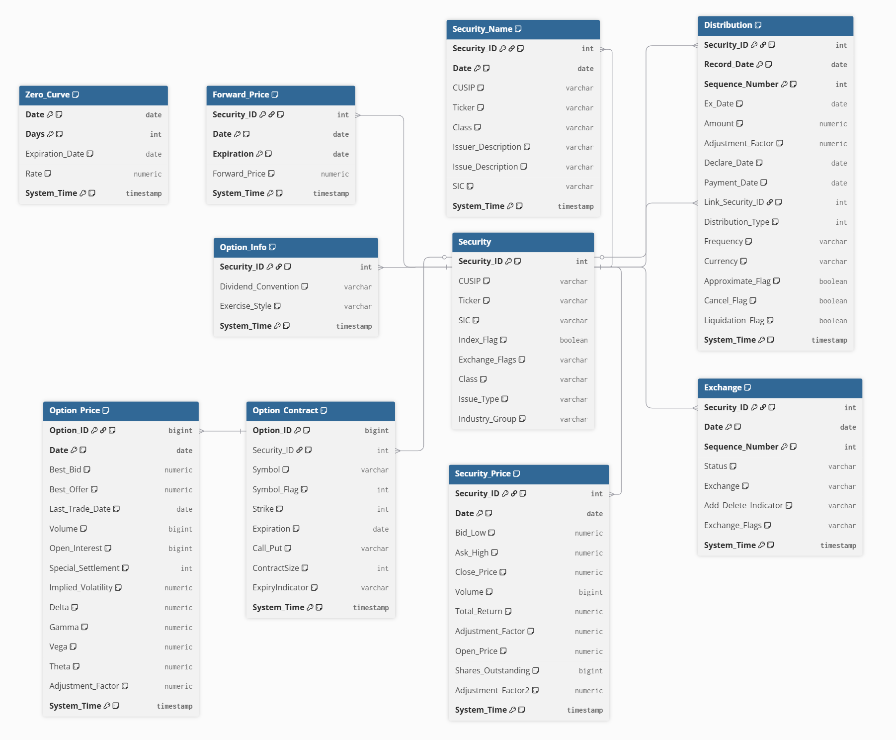
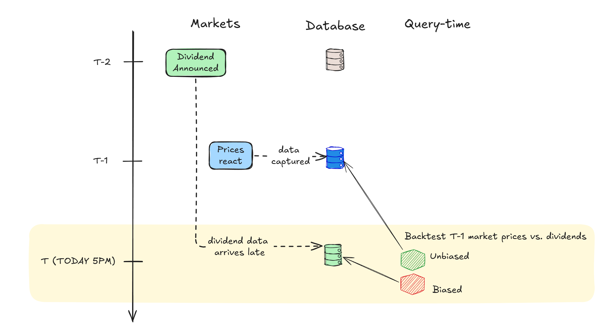

# Proposed Options Data Model

Contents:
1. [Business case background](#1-business-case-background)
2. [Core Data Model](#2-core-data-model)
3. [Major model decisions](#3-major-model-decisions)
4. [Assumptions](#4-assumptions)
5. [Edge Case Adjustments](#5-edge-case-adjustments)
6. [Improvements for Downstream Users](#6-improvements-for-downstream-users)
7. [Sample Datasets and Joins](#7-sample-datasets-and-joins)

---

## 1. Business case background

This section sets main assumptions of the business context. This serves as the background for:
- incoming data volume and velocity
- business logic for cross-table interactions

**The Business Flow:**

1.  **Sector & Equities Monitoring:** Ingesting strict reference data across different sectors (`Security`, `Security_Name`) to define the tradable universe point-in-time.

2.  **Signal Generation:** Researchers/ analysts query `Security_Price` and `Option_Price` to backtest or extract signals for their specific strategies.

3.  **Trade Planning & Risk Sensitivity:** Constructing portfolios using `Zero_Curve` and `Forward_Price` to model fair value and sensitivity to changes in pricing.

4.  **Position Tracking:** Re-weighting portfolios based on `Distribution` records and correctly tracking exact `Total Return`.

This flow was a combination of information from:
- Bridgewater's own investment thesis and positioning as a "systematic and macro fund". Including the "Investment Engine" which codifies macroeconomic cause-effect signals into a set of rules to execute upon.

- Online research of the components of a trading system. 
	- Idea generation 
	- -> backtesting 
	- -> detecting signals 
	- -> trade planning 
	- -> risk engine 
	- -> execution engine 
	- -> portfolio management
- Conversations with people in financial industry

The assumed use case requires the data model to have 2 key modifications explained in a later section.
1. Bi-temporality - the ability to query the data as it was exactly at a certain point-in-time.
2. Normalization of certain tables to improve storage and data cleanliness.

## 2. Core Data Model

This sections explains:
- business grain, logical PK, FK, notes on additional columns
- logical DB relations between tables

### Data Dictionary
See [`data_dictionary.md`](appendix/data_dictionary.md) for explicit table grains, types, and column explanations.

### Schema Diagram
Full schema with sample data can be explored at: [data-model-20260503 - dbdocs.io](https://dbdocs.io/oliverqsw/data-model-20260503?schema=public&view=relationships&table=Security).

Documented via [`schema.dbml`](./schema.dbml) and created using https://dbdiagram.io


## 3. Major model decisions

This section documents how and why the original model was improved to support expected data types, scaling, history handling, and prevent time-travel bias.

### A. Bitemporal Data Model (`System_Time`)

This is critical for auditing the trading systems that rely on data that was known at a specific **point-in-time**.

- **Event Time (Valid Time):** When did the event actually happen in the real world?
- **System Time (Transaction Time):** When did our database record this event?

System time is also the timestamp which a specific event was made available to the trading system.

**Issue**
When a revision is made to an event, our data model must differentiate between the 2 timelines. 



For example: a surprise dividend was announced on T-2 but was only made available to the system on T due to various delays. 

If the trading system then ran a backtest on 03 May without consideration of System Time, 

- It would see that price jumps on T-1 were correlated to the T-2 dividend announcement. 
- This is looking at **future data** it would not have had on T.

The correct method is for the trading system to ignore any data that was not available before T-1, which would exclude the surprise announcement.

**Implementation**
Bi-temporality is implemented in the data model via:
- Append-only tables. No `UPDATE` or `DELETE` operations.
- Addition of `System_Time` columns on all tables.

**Impact**
- Time-sensitive queries require `System_Time` to be qualified to the relevant time range. 
- Non-time sensitive queries require deduplication to the latest available data per table grain.


```sql
-- Example: a typical "walk-forward" backtest across multiple days of data for a given security

SELECT 
FROM
...
-- Qualify the available data to only those ingested on the same day up to 23:59:59
WHERE system_time < (date + INTERVAL '24 hours') 

-- Get the latest row for the table grain within the above subset
QUALIFY ROW_NUMBER() 
	OVER(
		PARTITION BY
			security_id, 
			date 
		ORDER BY 
			system_time DESC) = 1 
			
```


### B. Options Fact Normalization (`Option_Contract`)

This is specific to `Option_Price` and `Option_Contract` tables.

**Issue**
-  `Option_Price` expected to contain ~ 6 billion rows.
- Immutable characteristics (`Security_ID`, `Symbol`,`Strike`, `ContractSize`, `Expiration`) are duplicated across rows for the same `Option_ID`
- String columns take up more space than the daily value `numeric` columns
- Any queries that need unique `Option_Contract` characteristics but not daily prices will have to do expensive `GROUP BY` or `DISTINCT` operations on whole table every query.

**Implementation**
- Immutable characteristics are normalized into `Option_Contract` table
- Contract characteristics are never updated in real-world. A new `Option_ID` (i.e. `Symbol`) is created and old ID is invalidated. See [reference](https://www.webull.com/help/faq/10831-Corporate-Actions-and-Non-Standard-Options) explanation.

**Impact**
- Most queries on price will require additional `JOIN` between `Option_Price <> Option_Contract` to access `Security_ID` and `Symbol` columns.

## 4. Assumptions

This sections explains assumptions made about:
- certain columns and how they interact with each other mathematically / with business logic
- the mutability of certain data points from a business/ data provider perspective
- data types, and typical enums/ values from data sourcing.

### A. Expected Historical Data Size

**Justification:** Data model must scale to handle the daily generation of options data without degrading latency.

We assume roughly 250 trading days per year over a **25-year horizon**.

| Table             | Calculations<br>(25-Year History)                                                      | Est. Row Count  | Notes                                                                                                                                               |
| :---------------- | :------------------------------------------------------------------------------------- | :-------------- | :-------------------------------------------------------------------------------------------------------------------------------------------------- |
| `Security`        | ~20,000 active & delisted US tickers                                                   | ~20,000<br><br> | There are at least ~10,000 active tickers based on [SEC data]([sec.gov/files/company_tickers.json](https://www.sec.gov/files/company_tickers.json)) |
| `Distribution`    | 10,000 active securities $\times$ 4 actions/yr $\times$ 25 yrs                         | ~1 million      |                                                                                                                                                     |
| `Security_Price`  | 20,000 securities $\times$ 250 days $\times$ 25 yrs                                    | ~100 million    |                                                                                                                                                     |
| `Option_Contract` | 5,000 securities $\times$ ~200 new contracts/ year $\times$ 25 yrs                     | ~25 million     | Not all securities have options enabled.                                                                                                            |
| `Option_Price`    | ~1M **active** options $\times$ 250 days $\times$ 25 yrs                               | ~6 billion      | Requires normalization into Contract table.                                                                                                         |
| `Forward_Price`   | 5,000 securities $\times$ ~10 option expirations/day $\times$ 250 days $\times$ 25 yrs | ~300 million    | Pre-calculated daily forward price curve for every active security against every active option expiration date.                                     |
| `Zero_Curve`      | ~3,000 curve points/day $\times$ 250 days $\times$ 25 yrs                              | ~20 million     | Interpolated for each day from 1-day rate up to 3,000 day-rate (i.e. the 10Y rate)                                                                  |

### B. Incoming Data Reliability
**Justification:** Data vendors may issue data that is false, missing, revised, or late-arriving. This can be due to technical faults, or real-world business actions.

**Mitigation:** Bitemporal `System_Time` Model. 

Do not execute `UPDATE` or `DELETE` operations on historical data. If a vendor sends a correction for `Date = T-3`, it is `INSERT`ed as a new row with today’s `System_Time  = T`. 

For querying, we incur cost of complex queries for historical data integrity. Examples of this can be found in [`edge_cases.md`](appendix/edge_cases.md).


### C. Multiple Data Sources

**Justification:** There may be multiple vendors with different formats and data schemas. For example:
- [OPRA]([OPRA | Home](https://www.opraplan.com/)) provides real-time feeds
- OptionMetrics uses nightly FTP batch files
- Other reference data (like SIC codes and rates) might be pulled via REST APIs at a different time determined by BW engineers.

**Mitigation:** Logical Grain (business `Date`) is separated from the Physical Grain (`System_Time`), the data model does not care how the data arrives. Upstream ELT pipelines perform required normalization and data checks before pushing into the dataset with a single `System_Time`.

## 5. Edge Case Adjustments

This section covers possible downstream query scenarios and the required `JOIN` and `WHERE` qualifiers for handling them.

See [`edge_cases.md`](appendix/edge_cases.md) document.


## 6. Improvements for Downstream Users

### Suggested index strategy

While composite PKs are automatically indexed, it would be efficient to also index for common query patterns. 

| Index Category                             | Examples (non-exhaustive)                                                             | Rationale                                                                                                                                                                                                                                                                             |
| :----------------------------------------- | :------------------------------------------------------------------------------------ | :------------------------------------------------------------------------------------------------------------------------------------------------------------------------------------------------------------------------------------------------------------------------------------ |
| **Filters on string columns.**             | `Security(Ticker)`<br>`Security_Name(Ticker, Date DESC)`<br>`Option_Contract(Symbol)` | Analysts typically filter using readable names rather than the IDs of securities and contracts.                                                                                                                                                                                       |
| **Cross table joins using FKs.**           | `Option_Contract(Security_ID)`<br>`Distribution(Link_Security_ID)`                    | Since the option contract information is normalized from their contract prices, frequent joins without a FK index would cause full table scans. <br><br>A query like *"get all Meta/ Facebook options and corporate actions since IPO"*, would require these indexes to be efficient. |
| **Date filters for time-series analysis.** | `Security_Price(Date)`<br>`Option_Price(Date)`                                        | Ordering/ filtering across multiple dates on all pricing would bypass the composite PK index which starts with `Security_ID` or `Option_ID`.<br><br>We would need secondary indexing on the `Date` columns alone.                                                                     |

This assumes that the data is stored in standard row-based databases where individual columns need their own index on top of the PK composite index, but the same logic applies to columnar warehouses (Snowflake, BigQuery, Clickhouse, etc.)

### Suggested supporting tables/ views

- Downstream BI reporting tools and non-technical analysts typically only need the latest valid and available data. 
- These views reduce the need for downstream users to write additional `JOIN` to handle bi-temporal source tables. 
- Views will be materialized (daily) to avoid dynamically recomputing them on every query.

#### ref_dim_date
**Purpose:** Centralized trading calendar table for US markets. Maintained for consistent analytics as most queries rely on running experiments only on market open days.

| Column         | Type      | Description                | Example      | Notes                       |
| :------------- | :-------- | :------------------------- | :----------- | :-------------------------- |
| **Date**       | `date`    | Calendar date.             | `2023-08-11` | Primary Key.                |
| Is Trading Day | `boolean` | True if US exchanges open. | `1` (True)   | Filter for weekend/holidays |
| Is Holiday     | `boolean` | Recognized market holiday. | `0` (False)  |                             |

Why doesn't this have a `System_Time` column to handle when trading calendar changes?

- **Cost**: Adding `System_Time` would add additional QUALIFY computations on every downstream query that requires a date. 
- **Low risk**: It is extremely rare for US trading calendar to be unexpectedly changed other than national disasters or conflicts. 

#### vw_security_current
**Function:** Merges the latest ticker info per `Security`, accounting for any ticker updates and revisions.

**Value:** Serves as the basis for all other `JOIN`s into tables via `Security_ID` key. Having the latest `Ticker` available reduces the need for analyst to write the initial `JOIN` between `Security <> Security_Name`

**SQL Definition:**
```sql
CREATE VIEW vw_security_current AS
SELECT 
    s.Security_ID, 
    -- Use the latest updated information for each security
    sn.Ticker, 
    sn.CUSIP, 
    sn.Issuer_Description,
    sn.System_Time as Last_Updated
FROM Security s
JOIN (
    SELECT * 
    FROM Security_Name 
    QUALIFY ROW_NUMBER() OVER(
        PARTITION BY Security_ID 
        ORDER BY Date DESC, System_Time DESC
    ) = 1
) sn ON s.Security_ID = sn.Security_ID;
```

**Output Schema & Example Data:**

| Security_ID | Ticker | CUSIP    | Issuer_Description | Last_Updated       |
| :---------- | :----- | :------- | :----------------- | :----------------- |
| `10001001`  | `TSLA` | `037833` | `TESLA INC`        | `2022-01-01 16:30` |
| `10002002`  | `META` | `303030` | `META PLATFORMS`   | `2022-06-09 16:30` |


#### vw_latest_option_price / vw_latest_security_price
**Function:** Centralizes the maintenance and ownership of fresh data to the DE team, while maintaining ability to have bitemporal source tables.

**Value:** Prevents different analyst teams from writing custom window functions to select the latest revisions per business grain. 

**SQL Definition:**
```sql
CREATE VIEW vw_latest_option_price AS
SELECT *
FROM Option_Price
QUALIFY ROW_NUMBER() OVER(
    PARTITION BY Option_ID, Date 
    ORDER BY System_Time DESC
) = 1;
```
#### vw_split_adjusted_security_price
**Function:** Computes `Security_Price.Close_Price` with latest `Security_Price.Adjustment_Factor`.

**Value:** Non-adjusted values in source tables are complex to query and recompute in charting systems. 

This view physically computes `Close / Adjustment_Factor` dynamically so analysts do not need to account for adjustments from the source pricing tables.

**SQL Definition:**
```sql
CREATE VIEW vw_split_adjusted_security_price AS
SELECT 
    Security_ID,
    Date,
    ROUND(Close_Price / Adjustment_Factor, 2) AS Adjusted_Close,
    (Volume * Adjustment_Factor) AS Adjusted_Volume,
    ... -- and more columns like Bid and Ask as needed
FROM Security_Price
QUALIFY ROW_NUMBER() OVER(
    PARTITION BY Security_ID, Date 
    ORDER BY System_Time DESC
) = 1;
```

**Output Schema & Example Data:**

| Security_ID | Date         | Adjusted_Close | Adjusted_Volume |
| :---------- | :----------- | :------------- | :-------------- |
| `10001001`  | `2022-08-24` | `297.09`       | `3000000`       |
| `10001001`  | `2022-08-25` | `297.10`       | `3000000`       |

## 7. Sample Datasets and Joins

A simple mock database was populated to allow for testing queries. 

- **Database file**: [`data/mock_dataset.db`](data/mock_dataset.db)
- **Database init script**: [`data/build_mock_db.py`](data/build_mock_db.py)
- **Sample queries:** [`sample_queries.sql`](appendix/sample_queries.sql)